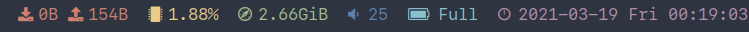
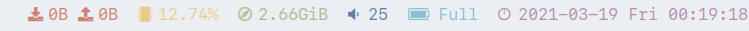
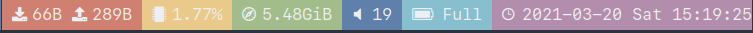

# Table of Contents

1.  [Goblocks](#org4fe7b3f)
    1.  [Intro](#org1ada354)
    2.  [Effect](#org47d93a1)
    3.  [Dependency](#org68f9563)
    4.  [Usage](#org7918c71)
    5.  [Configuration](#orga794274)
    6.  [Credit](#org42b387b)
    7.  [TODO](#orgad55678)


<a id="org4fe7b3f"></a>

# Goblocks


<a id="org1ada354"></a>

## Intro

A simple status monitor for dwm written by go (use nord palette default).


<a id="org47d93a1"></a>

## Effect





-   Time icon changes as time goes on.
-   Battery icon changes with battery state.
-   Volume icon changes with volume state.


<a id="org68f9563"></a>

## Dependency

Your dwmbar font should be a [nerd font](https://github.com/ryanoasis/nerd-fonts).

[pamixer](https://github.com/cdemoulins/pamixer) should be installed to get volume.

[status2d](https://dwm.suckless.org/patches/status2d/) should be patched to display color.


<a id="org7918c71"></a>

## Usage

You should change default network interface settings in config.toml to adjust your machine.

If you need change the default settings:

```shell
git clone https://github.com/ayamir/goblocks
cd goblocks
mkdir -p $HOME/.config/goblocks
cp config.toml $HOME/.config/goblocks
go build .
goblocks &
```

Or just use the default configuration:

```shell
git clone https://github.com/ayamir/goblocks
cd goblocks
mkdir -p $HOME/.config/goblocks
cp config.toml $HOME/.config/goblocks
export $GOBIN=$HOME/go/bin
export PATH=$GOPATH:$PATH
go get -u github.com/ayamir/goblocks
goblocks &
```


<a id="orga794274"></a>

## Configuration

The source code is extremely simple so you can hack all of it.

Of course, you can change icons and colors easily.

You can find about more colors usage at [status2d](<https://dwm.suckless.org/patches/status2d>)&rsquo;s webpage.

Like this:




<a id="org42b387b"></a>

## Credit

[gods](https://github.com/schachmat/gods) give me the initial inspire.


<a id="orgad55678"></a>

## TODO

-   [X] Read Config file
    -   [X] Network interface
    -   [X] Display color style
-   [ ] Clickable
-   [ ] Scrollable

